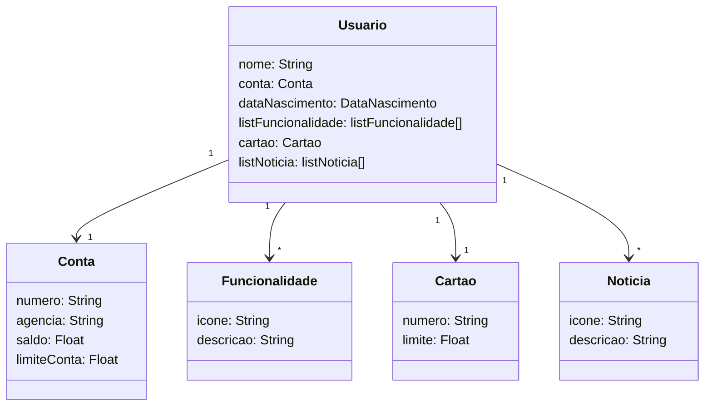

<h1>Santander Dev Week 2023 Java API</h1>
RESTful API da Santander Dev Week 2023 construída em Java 17 com Spring Boot 3.

<h3>Principais Tecnologias</h3>
<b>Java 17:</b> Utilizaremos a versão LTS mais recente do Java para tirar vantagem das últimas inovações que essa linguagem robusta e amplamente utilizada oferece;

<b>Spring Boot 3:</b> Trabalharemos com a mais nova versão do Spring Boot, que maximiza a produtividade do desenvolvedor por meio de sua poderosa premissa de autoconfiguração;

<b>Spring Data JPA</b> Exploraremos como essa ferramenta pode simplificar nossa camada de acesso aos dados, facilitando a integração com bancos de dados SQL;

<b>OpenAPI (Swagger):</b> Vamos criar uma documentação de API eficaz e fácil de entender usando a OpenAPI (Swagger), perfeitamente alinhada com a alta produtividade que o Spring Boot oferece;

<b>Railway:</b> facilita o deploy e monitoramento de nossas soluções na nuvem, além de oferecer diversos bancos de dados como serviço e pipelines de CI/CD.

<h2><a href="https://www.figma.com/file/0ZsjwjsYlYd3timxqMWlbj/SANTANDER---Projeto-Web%2FMobile?type=design&node-id=1421-432&mode=design">Figma</a></h2>

O Figma foi utilizado para a abstração do domínio desta API, sendo útil na análise e projeto da solução.

<h2>Diagrama de Classes:</h2>

<h3>Documentação da API (Swagger)</h3>

<h2><a href="https://spring-api-santander-bootcamp-production.up.railway.app/swagger-ui/index.html">Swagger API</a></h2>

Esta API ficará disponível no Railway por um período de tempo limitado.

