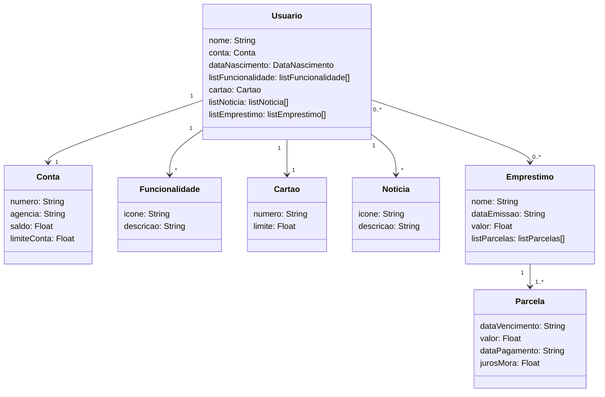

<h1>Desafio Final Santander Dev Week 2023 Java API</h1>
RESTful API para o BootCamp Santander da DIO, utilizando como base para o projeto - Figma (Santander).

<h3>Principais Tecnologias</h3>

* Java 17

* Spring Boot 3.1.4

* Spring Data JPA

* OpenAPI (Swagger)

* Railway

* Payara/Glassfish

<h2><a href="https://www.figma.com/file/0ZsjwjsYlYd3timxqMWlbj/SANTANDER---Projeto-Web%2FMobile?type=design&node-id=1421-432&mode=design">Figma</a></h2>

O Figma foi utilizado para a abstração do domínio desta API, sendo útil na análise e projeto da solução.

<h2>Diagrama de Classes:</h2>

- Implementado validações de campos, relacionamentos entre as tabelas (ida e volta), registro do vínculo dos relacionamentos em tabela.
- Implementado uma funcionalidade de Empréstímos para os usuários, com sua lista de Parcelas para os pagamentos.
- Validação das parcelas x Empréstimo

<h3>Documentação da API (Swagger)</h3>

<h2><a href="https://spring-api-santander-bootcamp-production.up.railway.app/swagger-ui/index.html">Swagger API Railway</a></h2> -> Esta API(Railway) ficará disponível por um período de tempo limitado.

